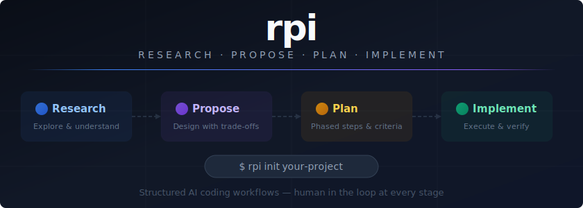
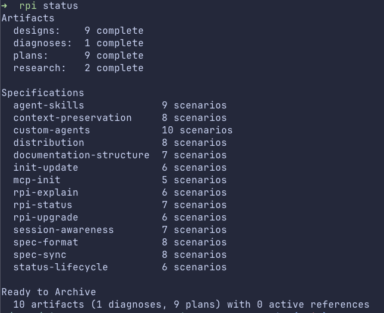

# AI Agent: Research-Propose-Plan-Implement Flow

[](LICENSE)
[](https://github.com/A-NGJ/rpi/releases/latest)
[](https://github.com/A-NGJ/rpi/actions/workflows/release.yml)

AI coding agents are capable -- the challenge is steering them. Without structure, you end up re-running prompts hoping the output lands closer to what you actually need. RPI gives you a framework to direct that capability: staged decisions, reviewable artifacts, and behavioral specs that keep work on track.

Each stage produces a document you can read, edit, and approve before the next one starts. A compiled Go CLI handles the bookkeeping so the LLM spends its tokens on thinking, not parsing. Built for [Claude Code](https://docs.anthropic.com/en/docs/claude-code) and [OpenCode](https://github.com/opencode-ai/opencode), but the methodology works with any AI coding tool.

## See It in Action

Add rate limiting to an API in four commands:

```
/rpi-research How does the API middleware chain work?
```
Claude explores your codebase conversationally. You discuss findings, no artifact required.

```
/rpi-propose Add per-endpoint rate limiting for authenticated and anonymous users
```
Claude presents 2-3 options with pros/cons tied to your codebase. You pick one. Writes `.rpi/designs/`.

```
/rpi-plan .rpi/designs/2026-03-04-api-rate-limiting.md
```
Breaks work into phases (core module, middleware integration, configuration), each with file changes, verification commands, and success criteria. Writes `.rpi/plans/`.

```
/rpi-implement .rpi/plans/2026-03-04-api-rate-limiting.md
```
Implements phase-by-phase -- runs tests, commits, and advances automatically when checks pass. Pauses only when manual verification is needed or something diverges from the plan. Runs in an isolated git worktree so your working tree stays clean until you merge.

## How RPI Is Different

RPI combines two things other tools don't: **reviewable artifacts that keep a human in the loop at every stage**, and a **compiled Go CLI that keeps mechanical work out of the LLM's context window**. The CLI handles scaffolding, frontmatter, artifact linking, and verification so the LLM focuses on the actual problem. Separating thinking from doing -- research gathers facts, propose makes decisions, plan specifies changes, implement executes them -- means review checkpoints catch bad decisions early, not after 500 lines of wrong code. All artifacts live in `.rpi/`, so context persists across sessions and teams. And by breaking work into stages, each conversation stays scoped to one job, keeping the context window small and output quality high.

**vs. [OpenSpec](https://github.com/Fission-AI/OpenSpec)** -- OpenSpec gives the AI more autonomy, implementing an entire plan in one pass. RPI gives you fine-grained control -- you review each implementation phase before it's executed, with git commits between phases for versioning and easy rollback. RPI also gives you full ownership of every command and skill -- they're plain markdown files you can read, edit, and customize after `rpi init`. OpenSpec's prompts are compiled into its npm package and regenerated on `openspec update`, so the workflow logic stays inside the tool rather than in your project.

**vs. unstructured prompting** -- Without stage boundaries, the LLM researches, designs, and implements in a single pass -- no checkpoints, no review, no way to course-correct before code is written.

## Quick Start

### Prerequisites

- [Claude Code CLI](https://docs.anthropic.com/en/docs/claude-code) or [OpenCode](https://github.com/opencode-ai/opencode)
- Git

### 1. Install `rpi`

**Quick install (recommended):**
```bash
curl -sSfL https://raw.githubusercontent.com/A-NGJ/rpi/main/install.sh | bash
```

Pin a specific version:
```bash
VERSION=v0.1.0 curl -sSfL https://raw.githubusercontent.com/A-NGJ/rpi/main/install.sh | bash
```

**From source (requires Go 1.25+):**
```bash
go install github.com/A-NGJ/rpi/cmd/rpi@latest
```

### 2. Initialize your project

```bash
rpi init /path/to/your/project                     # Claude Code (default)
rpi init /path/to/your/project --target opencode    # OpenCode
```

This creates:
- `.claude/` (or `.opencode/`) -- Agent Skills
- `.rpi/` -- Directory for all pipeline artifacts (tracked in git by default)
- `CLAUDE.md` (or `AGENTS.md`) -- Project-level instructions for the AI
- MCP server registration (Claude Code only) -- auto-registers `rpi serve` so the AI calls typed tools instead of shelling out

To update the `rpi` binary itself:
```bash
rpi upgrade         # download and install the latest release
```

To sync an existing project with the latest workflow files:
```bash
rpi update          # add missing dirs, update workflow files
rpi update --force  # also overwrite workflow files with latest versions
```

### 3. Try it

```
/rpi-plan Fix the date formatter in utils/dates.ts that returns "NaN" for ISO strings
```
Claude investigates, writes a phased plan to `.rpi/plans/`.

```
/rpi-implement .rpi/plans/2026-04-08-fix-date-formatter.md
```
Review the changes, approve, done. See the [full workflow guide](docs/workflow-guide.md) for more.

### The Slash Commands

| Command | What It Does | Output |
|---------|-------------|--------|
| `/rpi-research` | Investigates the codebase -- conversational fact-finding | Conversation (optionally `.rpi/research/YYYY-MM-DD-topic.md`) |
| `/rpi-propose` | Investigates, analyzes, and designs solutions with trade-offs | `.rpi/designs/YYYY-MM-DD-topic.md` + `.rpi/specs/feature.md` |
| `/rpi-plan` | Creates phased implementation plan with success criteria | `.rpi/plans/YYYY-MM-DD-topic.md` |
| `/rpi-implement` | Executes a plan phase-by-phase with verification | Code, tests, and commits |
| `/rpi-commit` | Creates focused git commits with smart grouping | Git commits |
| `/rpi-verify` | Validates implementation matches design artifacts | `.rpi/reviews/YYYY-MM-DD-topic.md` |
| `/rpi-diagnose` | Iterative root-cause analysis for complex bugs | `.rpi/diagnoses/YYYY-MM-DD-topic.md` + fix |
| `/rpi-explain` | Diff-scoped walkthrough of an implemented solution | Conversation |
| `/rpi-spec-sync` | Syncs specs to match current codebase (detect drift, rewrite, rename, merge) | Updated `.rpi/specs/` |
| `/rpi-archive` | Archives completed artifacts to keep `.rpi/` clean | Moves files to `.rpi/archive/` |

## Choosing Your Path

Not every task needs every stage. Match the path to your task's complexity:

- **Small tasks** (bug fixes, config changes) -- skip straight to **Plan -> Implement**. `/rpi-plan` does lightweight research on the fly.
- **Medium tasks** (focused features, single-concern changes) -- use **Propose -> Plan -> Implement**. Optionally run `/rpi-research` first if the codebase is unfamiliar.
- **Large tasks** (multi-concern features, major refactors) -- use **Propose -> Plan -> Implement**, where `/rpi-plan` decomposes the proposal into independently plannable units.

Not sure where to start? Use `/rpi-research` with any question -- it handles both focused investigation and open-ended research. For complex bugs, use `/rpi-diagnose` to iterate on root-cause analysis.

Not sure what's in flight? Run `rpi status` for a single-screen dashboard of all artifacts, progress, and what's ready to archive.

<details>
<summary><code>rpi status</code> example output</summary>



</details>

See the [full workflow guide](docs/workflow-guide.md) for detailed examples of each path.

## Documentation

- [Workflow Guide](docs/workflow-guide.md) -- Detailed examples of each path with tips
- [Stage Descriptions](docs/stages.md) -- How each command works, its modes, and output
- [`.rpi/` Directory](docs/thoughts-directory.md) -- Artifact structure, naming, status lifecycle, and team sharing
- [`rpi init`](docs/rpi-init.md) -- CLI bootstrapping, flags, shell completion, and OpenCode support
- [Architecture](docs/architecture.md) -- Why a Go binary, CLI commands, and project structure

## MCP Server

The `rpi` binary doubles as an [MCP](https://modelcontextprotocol.io/) server. Running `rpi serve` starts a stdio-based server that exposes all CLI operations as typed tools (`rpi_scaffold`, `rpi_scan`, `rpi_chain`, `rpi_frontmatter_get`, etc.). AI assistants call these tools with validated JSON schemas instead of constructing shell commands.

`rpi init` auto-registers the MCP server with Claude Code when both `rpi` and `claude` are in your PATH. Use `--no-mcp` to skip this. See [Architecture](docs/architecture.md) for details.

## Acknowledgments

Inspired by [HumanLayer](https://github.com/humanlayer/humanlayer) -- their work on human-in-the-loop patterns for AI agents informed the design of this workflow.

## License

MIT
